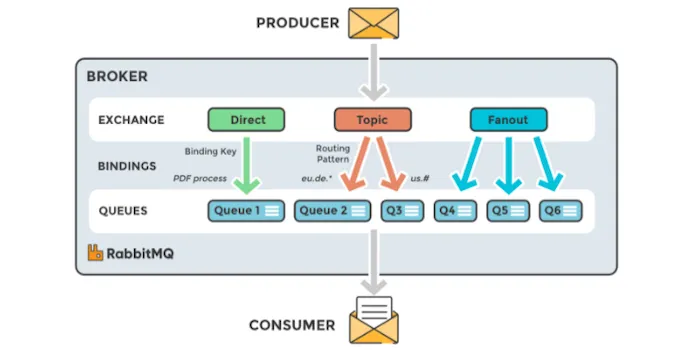

# 🛠️ 기술 스택
- Java 21
- Spring Boot 3.4.5
- RabbitMQ

# 📨 RabbitMQ
- AMQP Port : 5672
- 대시보드 Port : 15672

### 🔁 역할 및 흐름
Producer → Exchange → Queue → Consumer
- Producer : 메시지를 생성하여 Exchange에 전송
- Exchange : 메시지를 수신하고, 어떤 Queue에 보낼지 결정하는 역할
- Queue : 메시지를 저장하는 공간
- Consumer : Queue에서 메시지를 꺼내서 처리

Consumer가 없다면❓
- 메시지는 Queue에 저장된 채로 대기
- 수신자는 메시지를 받을 수 없음

### 💡 Exchange 종류
- Direct Exchange
    - 정확히 일치하는 라우팅 키를 가진 큐에만 메시지를 전달
    - ex) 1:1 채팅
- Topic Exchange
  - 패턴 매칭 기반
  - `*` 또는 `#` 사용
  - ex) 그룹별 메시지
- Fanout Exchange
    - 라우팅 키와 관계없이 연결된 모든 큐로 브로드캐스트
    - ex) 공지, 전체 알림
- Headers Exchange
    - 라우팅 키 대신 헤더 속성 값을 기반으로 라우팅
    - ex) 사용자 속성에 따른 메시지 전송

### 🗂️ 내용 정리
- https://blog.naver.com/yeondata/223851493671
- https://blog.naver.com/yeondata/223851519988
- https://blog.naver.com/yeondata/223854837629 (Exchange 유형별 정리)

# 📝 참고
- https://adjh54.tistory.com/292 (basic)
- https://adjh54.tistory.com/497?category=1187853